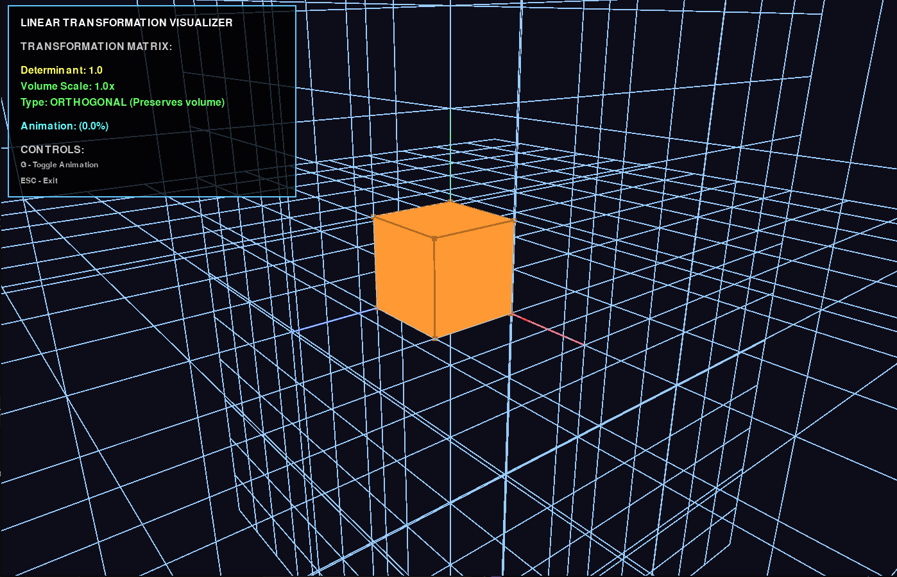
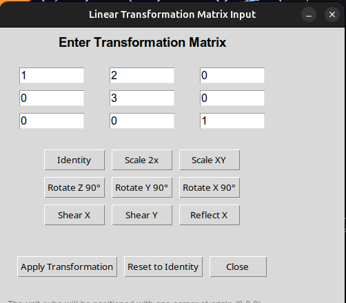
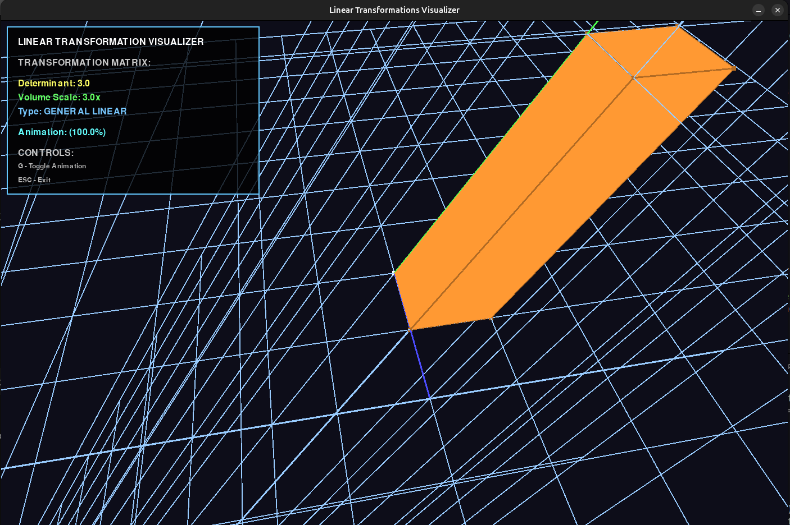
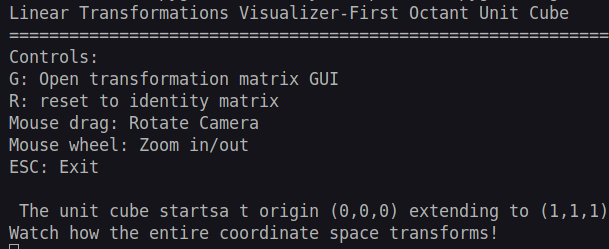

# Linear Transformation Visualizer

## Background
We use matrices throughout multiple fields of mathematics, but we seldom quite "see" what changes these matrices make.
A matrix with 0 as its determinant is non-invertible. But we can't really tell the reason behind it.

This project is an effort to visualize the mathematics that we've studied in our high school years: Linear Transformations

Highly inspired by 3Blue1Brown's work in visualizing mathematics, Linear Transformation Visualizer aims for a similar goal: for you to become clearer on what mathematics truly represents


---

## Some maths insights

In linear algebra, every linear transformation can be represented by a **matrix**.
Upon matrix multiplication, the entire space changes its dimenison: it stretches, rotates, reflects or skews.
And this program allows you to see the phenomenon!

**Note:**
* Determinant = Volume scaling factor
* Negative determinant → Orientation reversal

And what happens when the matrix is non-invertible? Run it to find out ;)
---

## Instructions to Run

### 1. Install dependencies

Make sure you have **Python 3.8+** installed.

Then run:

```bash
pip install pygame PyOpenGL PyOpenGL_accelerate numpy
```

### 2. Run the program

```bash
python linear_transformation_visualizer.py
```

---

## Code Overview

| Component                        | Description                                                                 |
| -------------------------------- | --------------------------------------------------------------------------- |
| `MatrixInputGUI`                 | Tkinter interface for entering and applying transformation matrices         |
| `LinearTransformationVisualizer` | Main OpenGL + Pygame visualizer for rendering and animating transformations |
| `apply_transformation()`         | Applies the given matrix to cube, grid, and basis                           |
| `update_animation()`             | Interpolates transformation for smooth visual transitions                   |
| `draw_info_panel()`              | Displays determinant, type, and control instructions overlay                |

---

## ⚙️ Dependencies

| Library    | Purpose                                             |
| ---------- | --------------------------------------------------- |
| `pygame`   | Window creation, input handling, and OpenGL context |
| `PyOpenGL` | 3D rendering and visualization                      |
| `numpy`    | Matrix and vector operations                        |
| `tkinter`  | Matrix input GUI                                    |

---

## 🧮 Example Transformations

| Transformation     | Matrix                                |
| ------------------ | ------------------------------------- |
| **Rotate Z (90°)** | `[[0, -1, 0], [1, 0, 0], [0, 0, 1]]`  |
| **Scale XY (2×)**  | `[[2, 0, 0], [0, 2, 0], [0, 0, 1]]`   |
| **Shear X**        | `[[1, 0.5, 0], [0, 1, 0], [0, 0, 1]]` |
| **Reflect X**      | `[[-1, 0, 0], [0, 1, 0], [0, 0, 1]]`  |

---

## Preview

*(If you plan to include screenshots later)*
Add an image like:

```markdown




```

---
